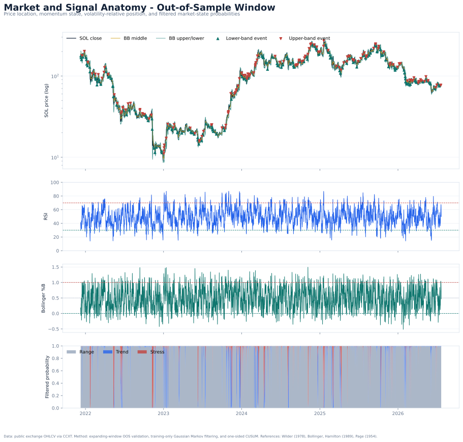
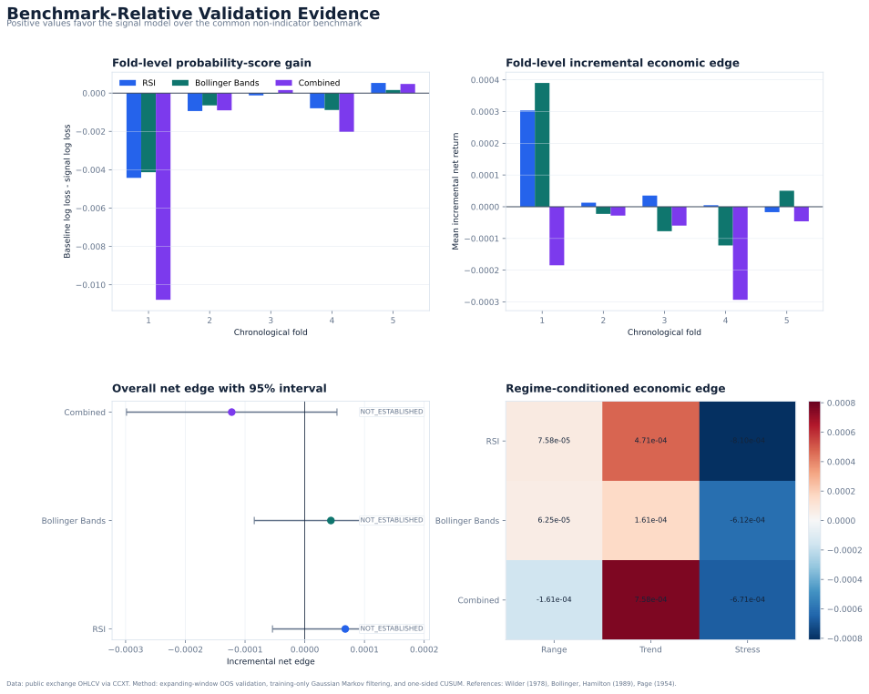
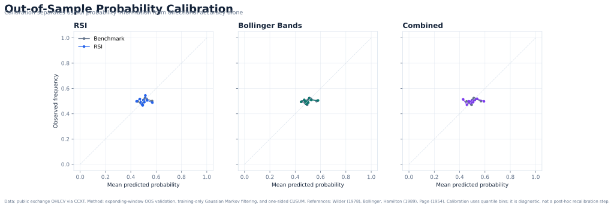
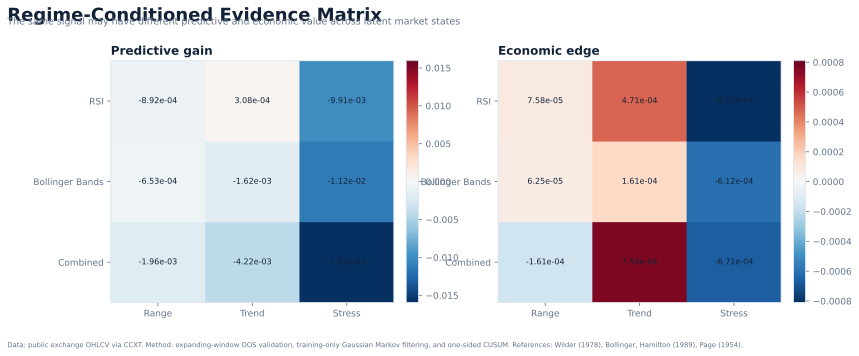
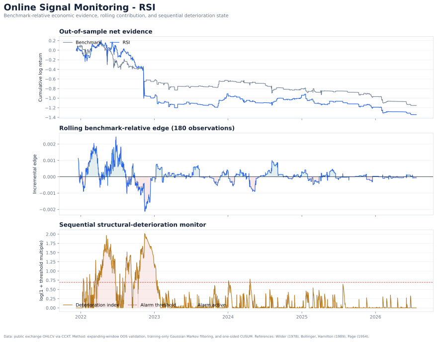
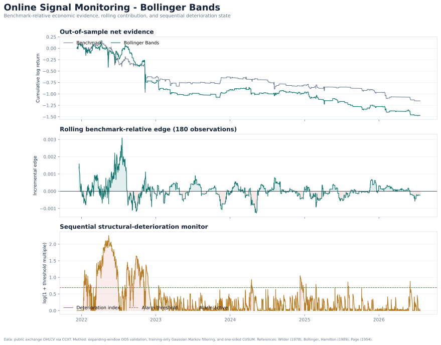
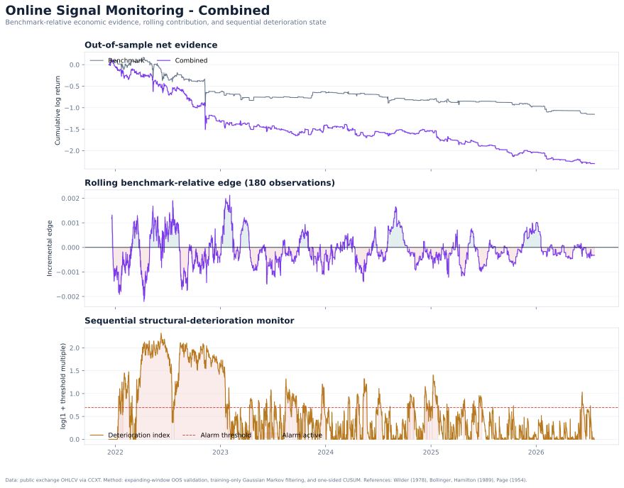

# Technical Signal Validity Framework - Version 1 Evidence Report

> Institutional benchmark-relative assessment of RSI and Bollinger Band information on four-hour SOL/USDT data.

## Executive determination

Under the frozen Version 1 specification, RSI did not demonstrate stable incremental predictive and economic contribution over the common non-indicator benchmark. The appropriate operational status is NOT_ESTABLISHED.

Under the frozen Version 1 specification, Bollinger Bands did not demonstrate stable incremental predictive and economic contribution over the common non-indicator benchmark. The appropriate operational status is NOT_ESTABLISHED.

The combined model is secondary. It tests complementarity between momentum and volatility-relative price location and does not replace either standalone conclusion.

## Assessment scope

- Sample: **2021-01-05 20:00:00+00:00** to **2026-07-22 04:00:00+00:00**
- Usable observations: **12,141**
- Forecast horizon: **1 four-hour candle(s)**
- Chronological folds: **5**
- Cost assumption: **10.0 bps per one-way position change**
- Primary empirical signal: **Bollinger Bands**

## Evidence hierarchy

The framework separates four evidence layers:

1. a threshold event was followed by a movement;
2. the signal improved a probability forecast beyond market variables;
3. the improvement remained economically positive after assumed costs;
4. any established contribution survived regime change and sequential monitoring.

This hierarchy prevents descriptive indicator behaviour from being treated as evidence of stable incremental predictability.

## Candidate-model determinations

| Signal | Stage 1 | Status | Predictive gain | Net edge | 95% interval | Current regime | Change alarm |
|---|---:|---:|---:|---:|---:|---:|---:|
| RSI | INCONCLUSIVE | NOT_ESTABLISHED | -1.150e-03 | 6.782e-05 | [-5.407e-05, 1.848e-04] | range | False |
| Bollinger Bands | INCONCLUSIVE | NOT_ESTABLISHED | -1.104e-03 | 4.377e-05 | [-8.458e-05, 1.760e-04] | range | False |
| Combined | NO_DESCRIPTIVE_EDGE | NOT_ESTABLISHED | -2.617e-03 | -1.223e-04 | [-2.985e-04, 5.395e-05] | range | False |

## Market-state-conditioned evidence

| Signal | Regime | Observations | Predictive gain | Net edge | Mean state probability |
|---|---:|---:|---:|---:|---:|
| Bollinger Bands | Range | 9,110 | -6.527e-04 | 6.248e-05 | 0.975 |
| Bollinger Bands | Stress | 373 | -1.124e-02 | -6.123e-04 | 0.836 |
| Bollinger Bands | Trend | 632 | -1.624e-03 | 1.612e-04 | 0.840 |
| Combined | Range | 9,110 | -1.960e-03 | -1.609e-04 | 0.975 |
| Combined | Stress | 373 | -1.595e-02 | -6.707e-04 | 0.836 |
| Combined | Trend | 632 | -4.224e-03 | 7.579e-04 | 0.840 |
| RSI | Range | 9,110 | -8.919e-04 | 7.578e-05 | 0.975 |
| RSI | Stress | 373 | -9.914e-03 | -8.101e-04 | 0.836 |
| RSI | Trend | 632 | 3.085e-04 | 4.712e-04 | 0.840 |

## Figures

### Market and signal anatomy

### Benchmark-relative validation dashboard

### Out-of-sample probability calibration

### Regime-conditioned evidence matrix

### RSI online monitoring

### Bollinger Bands online monitoring

### Combined-model online monitoring

## Institutional interpretation

A `NOT_ESTABLISHED` determination is substantive: the candidate may describe market conditions without adding information beyond trend, volatility, recent returns, volume, and BTC context. It does not imply that every historical indicator event was wrong; it means the incremental claim did not survive the declared validation contract.

A structural-deterioration alarm is not sufficient to suspend a candidate that did not pass establishment. The status hierarchy requires establishment before deterioration and deterioration before suspension.

## Scope boundaries

The V1 results are venue-, symbol-, timeframe-, sample-, and cost-specific. They exclude order-book depth, funding, open interest, liquidation intensity, venue-specific slippage, capacity, taxation, and live execution. The outputs constitute research evidence and do not represent investment advice or a trading recommendation.

## Sources, methodology, and reproducibility

**Data route.** Public exchange OHLCV accessed through the CCXT unified API. The data-validation record and run manifest document the usable sample and runtime configuration.

**Method frame.** RSI follows Wilder's formulation; Bollinger features include %B and BandWidth; market-state filtering is motivated by Hamilton's regime-switching framework; sequential monitoring uses Page's CUSUM principle; chronological splits follow time-series validation practice.

**Primary references.**

1. Wilder, J. W. (1978). New Concepts in Technical Trading Systems.
2. Bollinger, J. Official Bollinger Bands explanation and rules.
3. Hamilton, J. D. (1989). A New Approach to the Economic Analysis of Nonstationary Time Series and the Business Cycle.
4. Page, E. S. (1954). Continuous Inspection Schemes.
5. Diebold, F. X., & Mariano, R. S. (1995). Comparing Predictive Accuracy.
6. Hansen, P. R. (2005). A Test for Superior Predictive Ability.
7. scikit-learn TimeSeriesSplit, LogisticRegression, and calibration documentation.
8. CCXT unified public OHLCV API manual.

Full links and bibliographic details: [`../docs/REFERENCES.md`](../docs/REFERENCES.md).

Reproducibility manifest: [`run_manifest.json`](run_manifest.json).